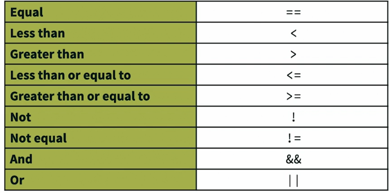

## README



### Example
```
irb(main):001:0> x = 1
irb(main):002:0> x == 1
=> true
irb(main):003:0> x == 2
=> false
```

### And operator && 

* The both condition must be true 

```
irb(main):008:0> x > 0 && x < 100
=> true
```
### Or operator || 

* Only of the of the condition can be true

```
irb(main):010:0> x >= 100 || x <= 50
=> true
```

### What does question mark "?" do?

* Anything in Ruby with `?` means it is querying the data

```
=> true
irb(main):011:0> [1, 2, 3].include?(2)
=> true
irb(main):012:0> [1, 2, 3].include?(4)
=> false
irb(main):013:0> [1, 2, 3].include?(3)
=> true
```

* More question mark example

```
irb(main):016:0> x
=> 1
irb(main):017:0> !x
=> false
irb(main):018:0> x.nil?
=> false
irb(main):019:0>
```

* hash and question mark 

```
irb(main):022:0> hash = {'a' => 1, 'b' => 2}
irb(main):023:0> hash
=> {"a"=>1, "b"=>2}
irb(main):028:0> hash.has_key?('a')
=> true
```

