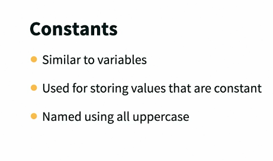
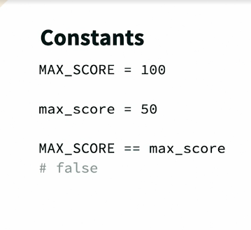
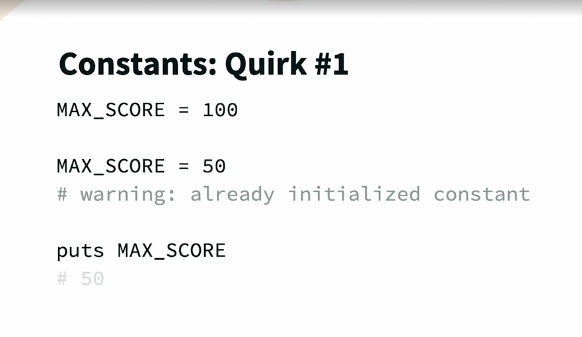

## Constants 

* Constrants are declared with all upper case or fiest letter of the contant needs to be in upper case 


* Example-1

```
irb(main):001:0> TEMP = 100
irb(main):002:0> TEMP
=> 100
irb(main):003:0> TEMP.class
=> Integer
```

* 
* 
* 
